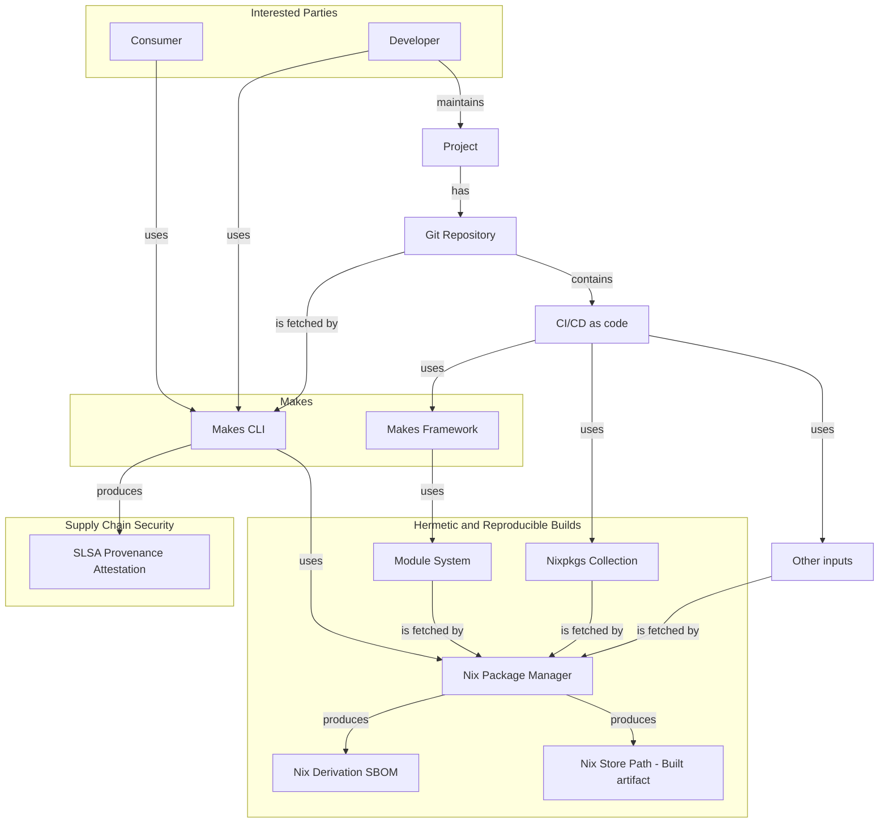

# Architecture

Below you will find a high-level diagram
of the Makes architecture

---

```mermaid
flowchart TB

  ci_cd_code[CI/CD as code]
  git_repo[Git Repository]
  inputs[Other inputs]
  project[Project]

  subgraph human[Interested Parties]
    consumer[Consumer]
    developer[Developer]
  end

  subgraph build[Hermetic and Reproducible Builds]
    nix[Nix Package Manager]
    nix_derivation[Nix Derivation SBOM]
    nix_store_path[Nix Store Path - Built artifact]
    nixpkgs_collection[Nixpkgs Collection]
    nixpkgs_module_system[Module System]
  end

  subgraph makes[Makes]
    makes_cli[Makes CLI]
    makes_framework[Makes Framework]
  end

  subgraph slsa[Supply Chain Security]
    slsa_provenance[SLSA Provenance Attestation]
  end

  consumer -- uses --> makes_cli
  ci_cd_code -- uses --> makes_framework
  ci_cd_code -- uses --> nixpkgs_collection
  ci_cd_code -- uses --> inputs
  developer -- uses --> makes_cli
  developer -- maintains --> project
  git_repo -- is fetched by --> makes_cli
  git_repo -- contains --> ci_cd_code
  makes_cli -- produces --> slsa_provenance
  makes_cli -- uses --> nix
  makes_framework -- uses --> nixpkgs_module_system
  inputs -- is fetched by --> nix
  nixpkgs_collection -- is fetched by --> nix
  nixpkgs_module_system -- is fetched by --> nix
  nix -- produces --> nix_derivation
  nix -- produces --> nix_store_path
  project -- has --> git_repo
```
