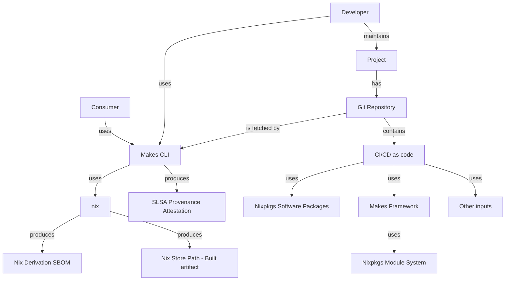

<!--
SPDX-FileCopyrightText: 2022 Fluid Attacks and Makes contributors

SPDX-License-Identifier: MIT
-->

# Architecture

```mermaid
flowchart TB
inputs[Other inputs]
  makes_cli[Makes CLI]
  makes_framework[Makes Framework]
  slsa_provenance[SLSA Provenance Attestation]
  nix_derivation[Nix Derivation SBOM]
  nix_store_path[Nix Store Path - Built artifact]
  nixpkgs_collection[Nixpkgs Software Packages]
  nixpkgs_module_system[Nixpkgs Module System]
  consumer[Consumer]
  developer[Developer]
  project[Project]
  git_repo[Git Repository]
  ci_cd_code[CI/CD as code]
  inputs[Other inputs]

  consumer -- uses --> makes_cli
  ci_cd_code -- uses --> nixpkgs_collection
  ci_cd_code -- uses --> makes_framework
  ci_cd_code -- uses --> inputs
  developer -- uses --> makes_cli
  developer -- maintains --> project
  git_repo -- is fetched by --> makes_cli
  git_repo -- contains --> ci_cd_code
  makes_cli -- uses --> nix
  makes_cli -- produces --> slsa_provenance
  makes_framework -- uses --> nixpkgs_module_system
  nix -- produces --> nix_derivation
  nix -- produces --> nix_store_path
  project -- has --> git_repo
```
